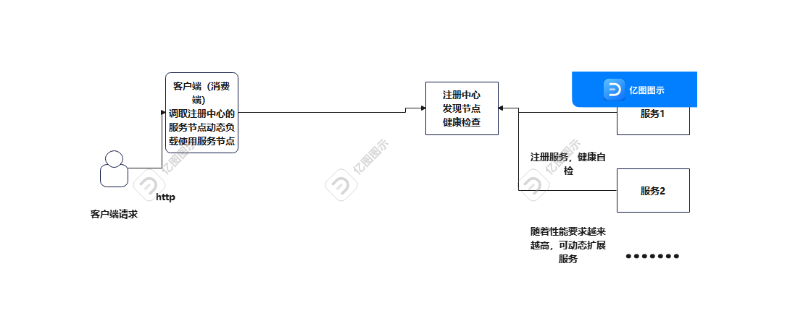
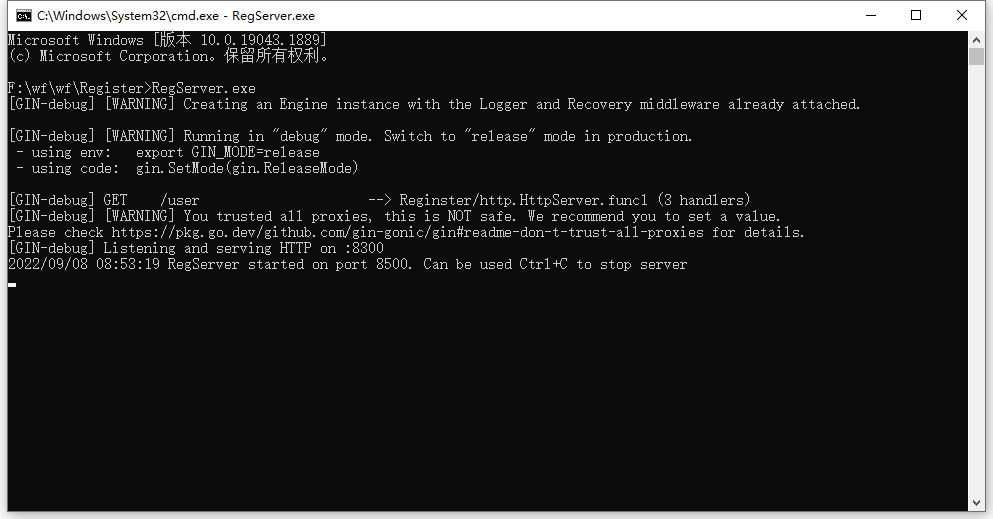
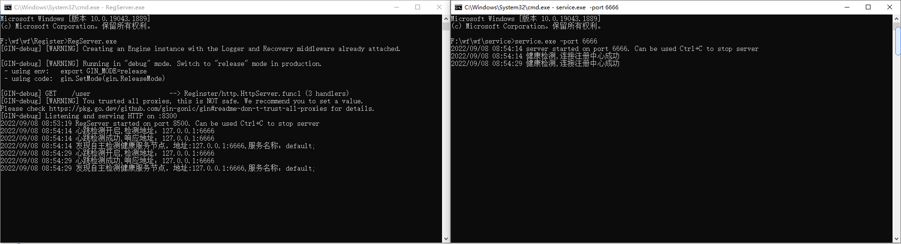
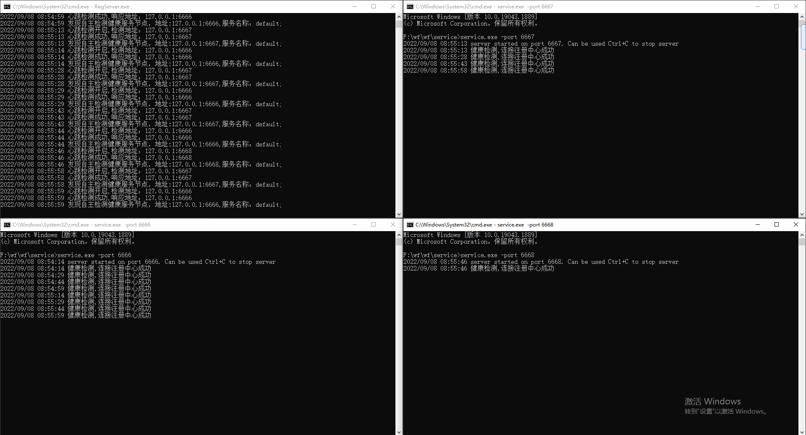
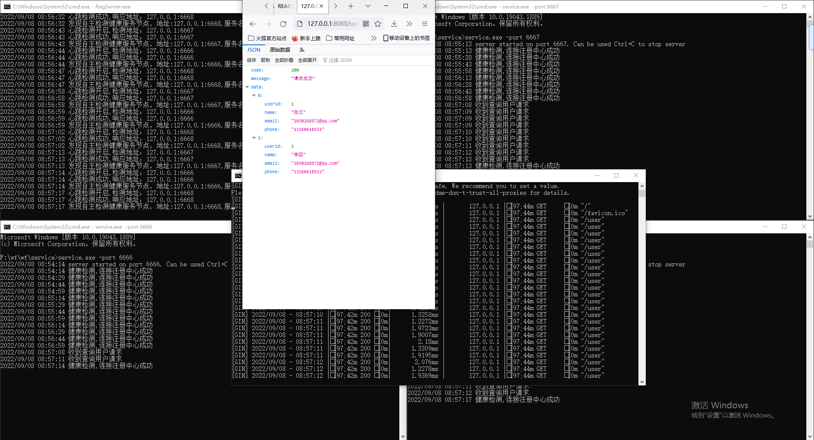
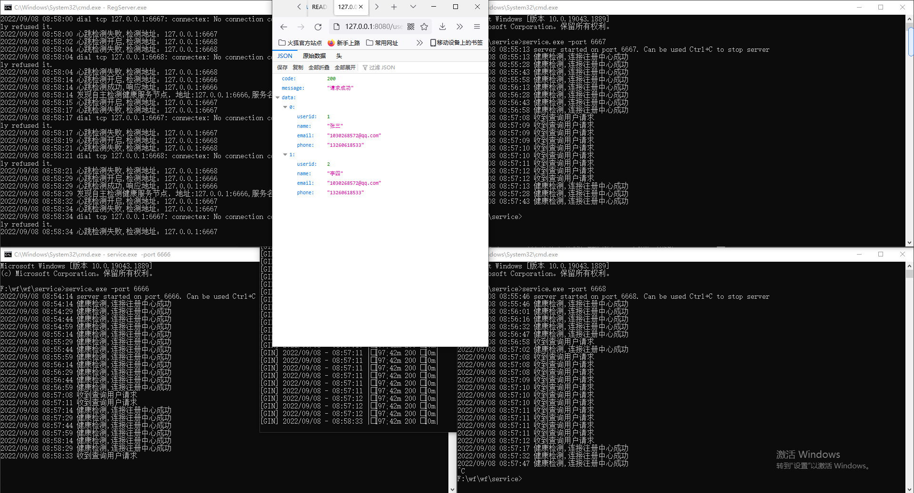
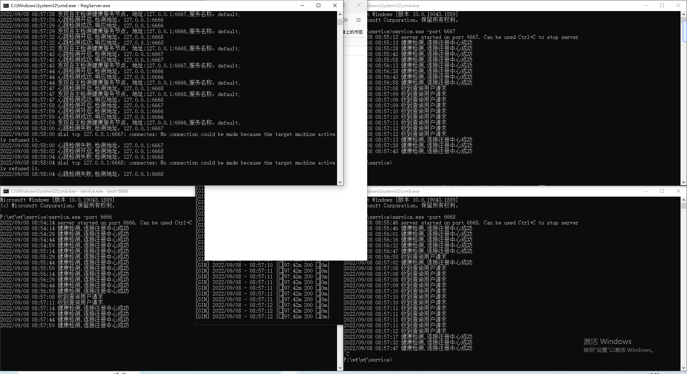
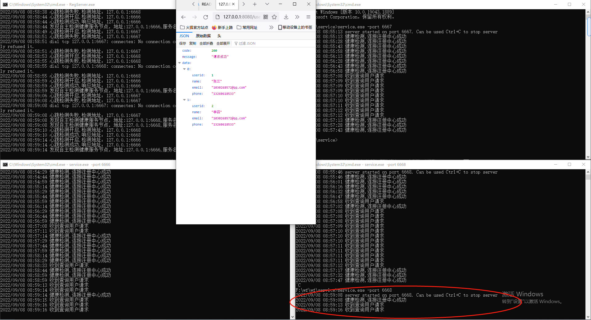

# wf
一个可以动态扩展服务的项目，目前情况如下图  
  
未完成：  
（1）统一认证模块  
（2）统一日志模块  
（3）统一服务网关  

目前实现效果图：  
1、注册中心：  
  
2、服务启动注册中心发现：  
  
3、多服务启动注册发现:  
  
4、客户端请求多服务动态负载响应：
  
5、只留一个服务业务正常运行:  
  
6、服务掉线告警:  
  
7、新服务上线自动注册并提供服务:  
  
  
  
目前还有很多功能未实现，希望有志之士一起完善